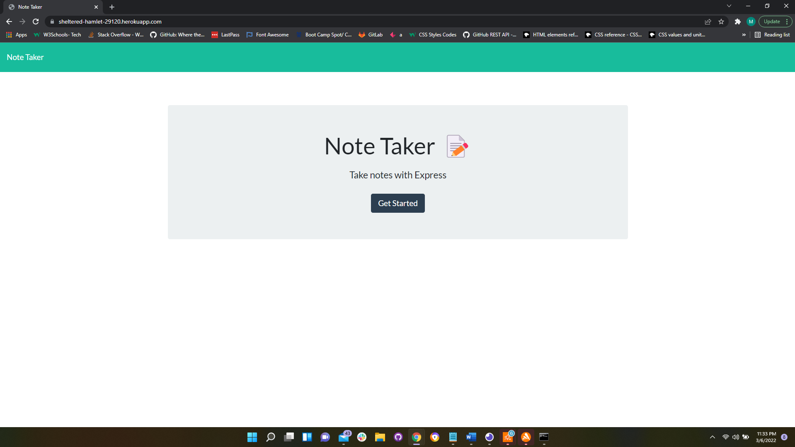

# Note Taker Starter Code

## Deployed Application
https://sheltered-hamlet-29120.herokuapp.com/

## Description
This is a web application that can be used to write and save notes, as well as, delete existing/saved notes. This app was built with Express.js back end and saves and retrieves note data from a JSON file.

## Screenshots
Homepage


Notes page


## Table of Contents
* [Installation](#installation)
* [License](#license)
* [Contributing](#contributing)
* [Tests](#tests)
* [Questions](#questions)

## Installation 
1. Clone the repository

```bash
git clone https://github.com/MuboHouston/note-taker.git
```

2. Change the working directory

```bash
cd note-taker
```

3. Install dependencies

```bash
npm install
```

4. Run the app

``` bash 
npm start
```

## License 
MIT

## Contributing 
Contributions, issues, and feature requests are welcome!

## Tests
N/A

## Questions
Find me on GitHub: https://github.com/MuboHouston